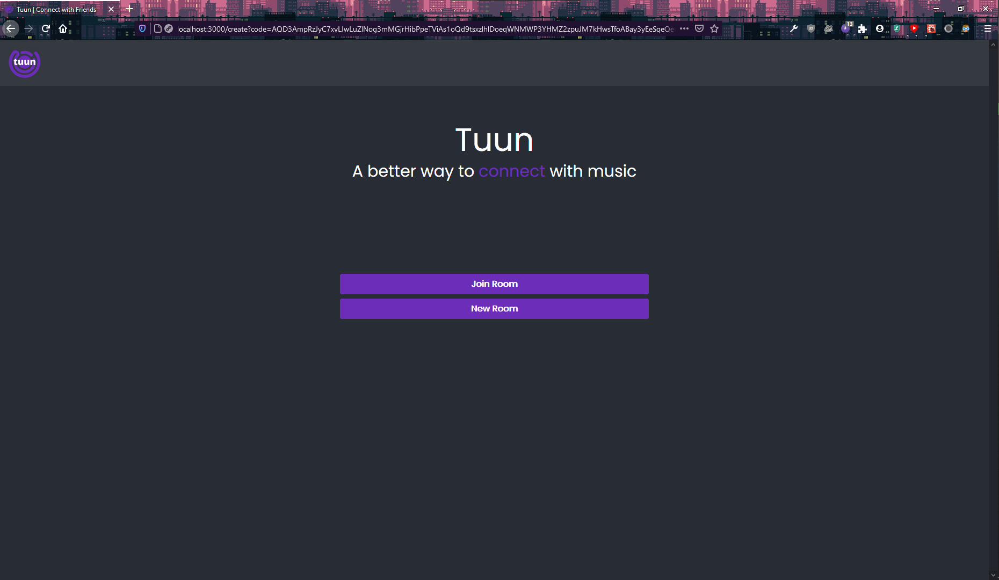
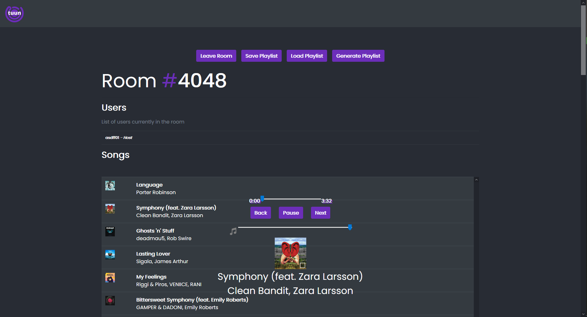
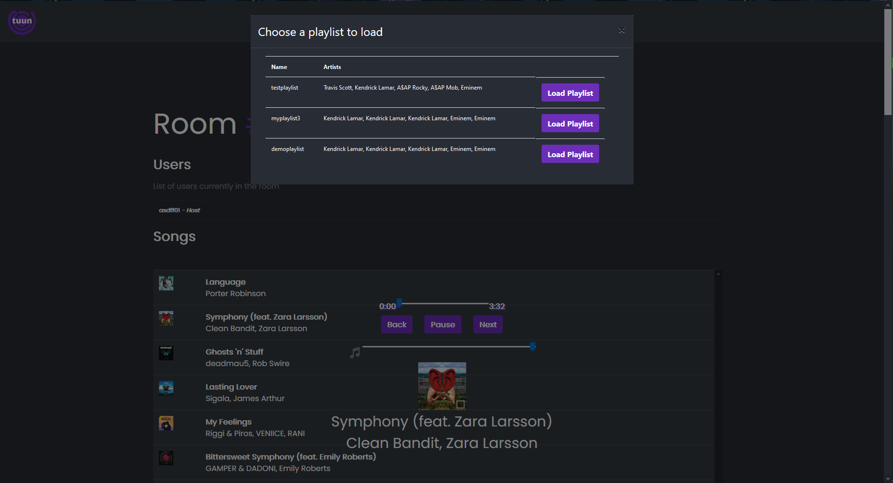
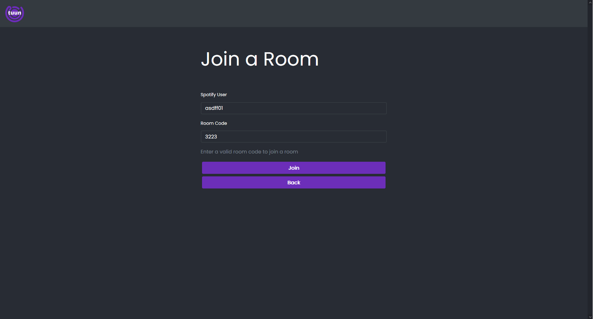

# tuun
Music service to create playlists between individuals within a group.

## tuun-ui

This project was bootstrapped with [Create React App](https://github.com/facebook/create-react-app).

### Available Scripts

*NOTE:* If you do not have npm installed, these scripts will not work. Install npm from the terminal with `brew install node` with HomeBrew or [Install Node / npm](https://www.npmjs.com/get-npm)

Run `npm i` to install / update dependencies for the project prior to running.

In the project directory, you can run:

### `npm start`

Runs the app in the development mode. 
Open [http://localhost:3000](http://localhost:3000) to view it in the browser.

The page will reload if you make edits. 
You will also see any lint errors in the console.

# Screenshots

## The Landing Page

## The Room Page

## Loading a Playlist

## Joining a Room

